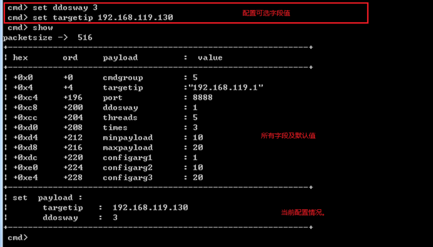
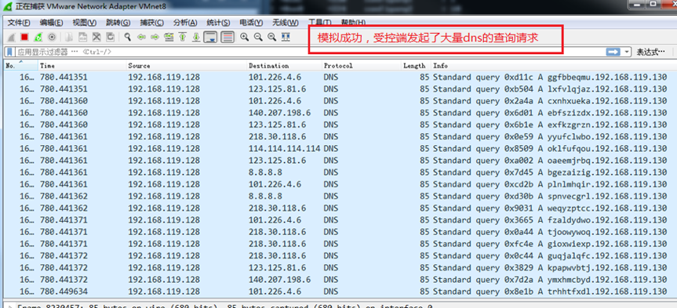

# CC模拟器使用帮助

可实时组装协议包，并向客户端发送。

## 文件介绍
    simulator.py 模拟器主程序，负责读取配置文件及开启监听端口
    bot9527.py   bot9527 样本家族的协议描述文件，供模拟器加载，模拟bot9527家族的CC端


## 使用概述
    $ python simulator.py bot9527 8888   
        > 进行bot9527家族的CC模拟
    当有受控端上线后，控制台将打印出上线包内容，并开启一个内置shell控制台。


## 使用样例   
    > (以我正在分析的 bot9527 家族 2b770a153d3cbd14bdc85e921e5bad75为例)
        该样例，在《README的辅助图》中有截图记录，可配合阅读
    1-step) 通过修改host记录，或修改样本文件，来接管样本上线地址。
            该样本上线地址为: www.avttx.cn:60080
    2-step) 在控制机启动bot9527家族模拟器。
    3-step) 在虚拟机运行被测样本，模拟器收到上线包后，会得到一个指令提示符。
            ```cmd> ```
            
            
    4-step) 将ddosway字段设置为 3 以执行dns随机请求的攻击指令。
            ```cmd> set ddosway 3```
            默认的攻击目标为192.168.119.1，将攻击目标切换为 192.168.119.130
            ```cmd> set targetip 192.168.119.130```
            
            查看当前配置情况
            ```cmd> show```
    5-step) 启动攻击
            ```cmd> attack```
            
    6-step) 此时就可以使用抓包工具来检查模拟是否生效，以判断当前的协议分析结果是否正确。
            如发现结果不正确，可随时更改 bot9527.py 文件进行实时调试，文件发生更改后，
            可使用reload指令重新加载配置文件。
            
    7-step) 上述操作无误后，可在抓包工具中得到大量伪造的dns查询请求，
            这边是3 号指令对应的攻击方式。
            

## 配置文件的字段含义(以bot9527家族为例)
    现阶段，每个配置文件包含有四个核心字段
        a) packetsize  该字段为控制包总大小；
        b) regsize     该字段为上线包大小，如无上线包，则该值设为0
        c) packet      该字段为控制包描述（根据逆向结果自行定义），
                        包含字段名，数据类型，字段偏移，及默认值。
        d) testcase    该字段为受控端可接收的指令集，包含两个必填字段及一个可选字段
                        (根据模拟要求，进行指定)
            d-1)  fieldname 必选字段，为指令所需配置的字段列表
                比如stateCheck只需在控制指令中配置cmdgroup字段即可
                而attack指令，则需要配置cmdgroup,targetip,port ddosway 等多个参数字段。
            d-2) valuefix   值修复字段，为使用当前指令时需要修复的字段值，
                stateCheck指令时，cmdgroup值为0x31 ；
                stop指令时，cmdgroup值为 0x02 ；
                以此类推。
            d-3) acksize，   指令回复字段，当控制指令执行后，要求被控端回复执行结果时，
                可设置该字段，该字段为回包大小，收到回复包后，会在控制台以16进制形式进行展示。
    两个非必填字段：
        a) cmdhelp，该字段可根据自己需求填写辅助信息，在bot9527中，用于备忘不同攻击方式对应的指令值。
        b) sampleList, 该字段为被分析的样本，用于备忘可控样本md5值，方便日后家族协议比对。
